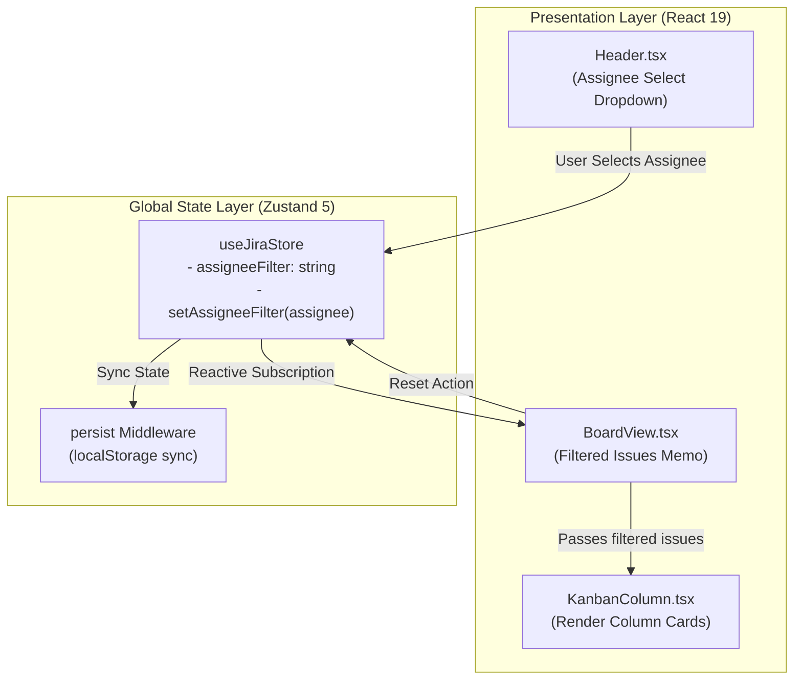

# 🏛️ Architecture Spine: Assignee Filer Option
## System Solutioning & Invariant Contract (Phase 3A)

---

## 1. Context & Architectural Altitude

- **System Context:** Jira Kanban Sprint Board (`jira-clone`), a React 19 + TypeScript + Zustand client application.
- **Architectural Scope:** Integration of an Assignee Filter dimension into the existing global state store, header controls toolbar, and board filtering pipeline.
- **Prerequisite Invariant:** Derives from the approved PRD (`_acl-output/2-plan-workflows/acl-prd/prd.md`) with zero regressions to existing board operations, card drag-and-drop, modals, or test suites.

---

## 2. Core Paradigm & Invariants



### Architectural Decisions (ADs)

#### AD-01: State Slicing in `useJiraStore` [ADOPTED]
- **Binds:** `src/store/useJiraStore.ts`
- **Prevents:** State synchronization fragmentation across disparate React local states.
- **Rule:** 
  - Add `assigneeFilter: string` to `JiraState` with initial default value `'all'`.
  - Add `setAssigneeFilter: (assignee: string) => void` to actions.
  - State updates MUST be immutable (return new object reference without mutating previous state).
  - Include `assigneeFilter` in the `persist` middleware storage configuration so user filter preferences persist across page reloads.

#### AD-02: Dynamic Assignee Extraction & Normalization [ADOPTED]
- **Binds:** `src/components/Header.tsx`
- **Prevents:** Hardcoded team member lists diverging from issues created/edited in the board.
- **Rule:**
  - Extract unique assignees dynamically from the store's `issues` collection:
    ```typescript
    const uniqueAssignees = useMemo(() => {
      const names = new Set(issues.map((i) => i.assignee).filter(Boolean));
      return Array.from(names).sort((a, b) => a.localeCompare(b));
    }, [issues]);
    ```
  - The dropdown renders:
    1. `<option value="all">All Assignees</option>` (default).
    2. Dynamic assignee names mapped alphabetically.
  - If the active `assigneeFilter` is not in the extracted list and not `'all'`, gracefully fallback to `'all'`.

#### AD-03: Composite Multi-Filter Evaluation [ADOPTED]
- **Binds:** `src/components/BoardView.tsx`
- **Prevents:** Inconsistent or conflicting filter predicates between search, priority, and assignee.
- **Rule:**
  - All filter criteria are composed using strict logical AND:
    ```typescript
    const filteredIssues = useMemo(() => {
      return issues.filter((issue) => {
        const matchesSearch =
          searchQuery.trim() === '' ||
          issue.title.toLowerCase().includes(searchQuery.toLowerCase()) ||
          issue.id.toLowerCase().includes(searchQuery.toLowerCase()) ||
          issue.assignee.toLowerCase().includes(searchQuery.toLowerCase());

        const matchesPriority =
          priorityFilter === 'all' || issue.priority === priorityFilter;

        const matchesAssignee =
          assigneeFilter === 'all' || issue.assignee === assigneeFilter;

        return matchesSearch && matchesPriority && matchesAssignee;
      });
    }, [issues, searchQuery, priorityFilter, assigneeFilter]);
    ```

#### AD-04: Composite Filter State Invalidation & Reset [ADOPTED]
- **Binds:** `src/components/BoardView.tsx`
- **Prevents:** Stale empty states and orphaned active filter conditions.
- **Rule:**
  - Active filter detector:
    ```typescript
    const hasActiveFilters = searchQuery !== '' || priorityFilter !== 'all' || assigneeFilter !== 'all';
    ```
  - The `resetFilters` handler MUST atomically reset all filter vectors:
    ```typescript
    const resetFilters = () => {
      setSearchQuery('');
      setPriorityFilter('all');
      setAssigneeFilter('all');
    };
    ```

#### AD-05: Strict TypeScript & CSS System Invariants [ADOPTED]
- **Binds:** Global codebase (`src/styles.css`, `src/types/jira.ts`)
- **Prevents:** Build failures and style regression against `project-context.md`.
- **Rule:**
  - No TypeScript Enums. Use string union or string primitive.
  - Types imported using `import type { ... }` (`verbatimModuleSyntax`).
  - Use native CSS custom properties in `.assignee-filter-container` matching `.priority-filter-container`:
    - `var(--border-color)`
    - `var(--bg-canvas)`
    - `var(--text-primary)`
    - `var(--radius-md)`
  - No external styling packages or Tailwind classes introduced.

---

## 3. Component Contract & Interface Delta

```typescript
// Interface delta in src/store/useJiraStore.ts
export interface JiraState {
  // Existing state...
  issues: Issue[];
  searchQuery: string;
  priorityFilter: Priority | 'all';
  assigneeFilter: string; // <-- NEW
  selectedIssue: Issue | null;
  isModalOpen: boolean;
  modalInitialStatus: IssueStatus;

  // Existing actions...
  setSearchQuery: (query: string) => void;
  setPriorityFilter: (priority: Priority | 'all') => void;
  setAssigneeFilter: (assignee: string) => void; // <-- NEW
  // ...
}
```

---

## 4. Verification & Testing Strategy

1. **Store Unit Tests (`src/store/__tests__/useJiraStore.test.ts`):**
   - Verify initial `assigneeFilter` is `'all'`.
   - Verify `setAssigneeFilter` updates filter value immutably.
   - Verify filter resets cleanly with `resetFilters`.
2. **Component Integration Tests (`src/components/__tests__/BoardFiltering.test.tsx`):**
   - Verify rendering of Assignee dropdown with dynamic options.
   - Verify selecting an assignee hides non-matching cards across columns.
   - Verify multi-filter composition (Assignee + Priority).
   - Verify empty state message displays active assignee and reset button works.
3. **Regression Suite:**
   - Execute `npm test` and `npm run lint` with 100% pass guarantee.
